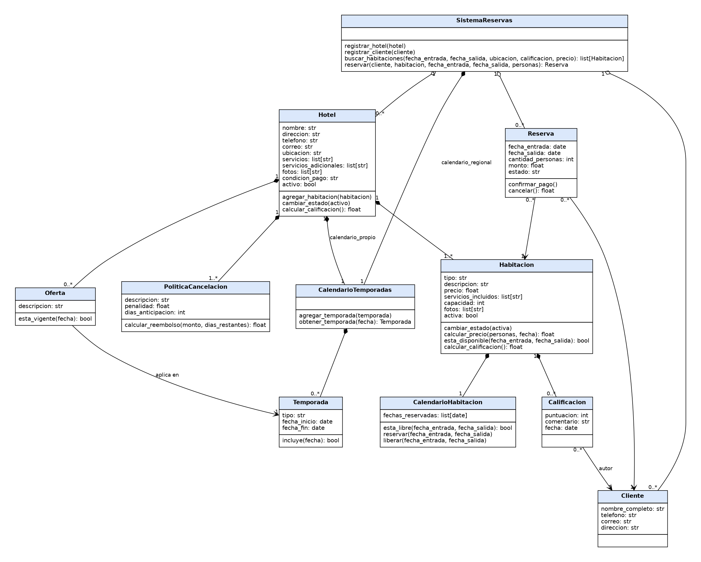

# Sistema de Agencia de Viajes

 


- ver [badgen](https://badgen.net/) o [shields](https://shields.io/) para otros tipos de _badges_

## Autor

- [@estudiante](https://www.github.com/estudiante)

## Descripción del Proyecto

Sistema de consola, desarrollado en Python con la librería `rich`, para gestionar las reservas de hoteles. Permite registrar hoteles y sus habitaciones, registrar clientes, buscar habitaciones, reservarlas mediante un pago y calificarlas después de la estancia.

Los requerimientos salen de la entrevista con la administradora del hotel, disponible en [`docs/entrevista.pdf`](./docs/entrevista.pdf).

## Documentación

Revisar la documentación en [`./docs`](./docs)

### Requerimientos

- **R1**: El sistema debe registrar un hotel con su nombre, dirección, teléfono, correo electrónico y ubicación geográfica.
- **R2**: El sistema debe permitir describir los servicios de un hotel (por ejemplo restaurante, piscina o gimnasio) y asociarle fotos.
- **R3**: El sistema debe permitir registrar las ofertas y promociones por temporada de un hotel (como descuentos en temporada baja o paquetes especiales) y sus servicios adicionales (como estacionamiento o áreas de coworking).
- **R4**: El sistema debe permitir registrar las condiciones de pago y la política de cancelación de cada hotel, que pueden variar según el tipo de habitación y la temporada.
- **R5**: El sistema debe manejar el estado de actividad de un hotel (activo o inactivo, por ejemplo cerrado por reformas).
- **R6**: El sistema debe registrar las habitaciones de un hotel con su tipo, descripción, precio, servicios incluidos, capacidad y fotos.
- **R7**: El sistema debe manejar el estado de actividad de una habitación (activa o inactiva por mantenimiento, remodelación o desinfección).
- **R8**: El sistema debe considerar para las reservas únicamente los hoteles y las habitaciones activos.
- **R9**: El sistema debe calcular el precio de una habitación según la cantidad de personas que se alojan, sin exceder su capacidad máxima.
- **R10**: El sistema debe calcular el precio de una habitación según la temporada.
- **R11**: El sistema debe manejar un calendario de temporadas propio de cada hotel y un calendario regional de temporadas que la mayoría de los hoteles sigue.
- **R12**: El sistema debe manejar un calendario por habitación que indique las fechas en que está reservada y las fechas en que está disponible.
- **R13**: El sistema debe registrar clientes con su nombre completo, número de teléfono, correo electrónico y dirección.
- **R14**: El sistema debe permitir buscar habitaciones por fecha, ubicación, calificación o precio, y combinar varios criterios.
- **R15**: El sistema debe mostrar el detalle de una habitación: descripción, características, servicios incluidos, fotos, calificación y comentarios de otros huéspedes.
- **R16**: El sistema debe permitir al cliente confirmar la habitación seleccionada y realizar el pago; la reserva queda formalizada cuando se confirma el pago.
- **R17**: El sistema debe permitir cancelar una reserva y calcular el reembolso según la política de cancelación del hotel (penalidad o reembolso completo según la anticipación).
- **R18**: El sistema debe permitir al cliente, después de su estancia, calificar y comentar la habitación.
- **R19**: El sistema debe calcular la calificación promedio de cada habitación y la calificación general de cada hotel.

### Diseño




### Categorías de habitación

Cada habitación se registra en una de estas tres categorías, que sirve para filtrar en la búsqueda:

|categoría|descripción|
|:---|:---|
|silver|Habitación estándar, con los servicios básicos incluidos|
|gold|Habitación superior, con más espacio o servicios adicionales (ej: aire acondicionado)|
|platinum|Habitación de lujo (ej: suite), con los mejores servicios y ubicación del hotel|

El precio de cada habitación lo define el hotel al registrarla; la categoría no fija un precio, solo la clasifica.

## Instalación

El proyecto requiere Python 3 y usa la librería `rich` para mostrar la interfaz en la consola. Se recomienda instalarlo dentro de un entorno virtual para no mezclar sus dependencias con las de otros proyectos. En Windows el entorno virtual se activa con `venv\Scripts\activate`.

1. Clonar el proyecto

    ```bash
    git clone https://github.com/mastercelta/lpa1-taller-requerimientos.git
    ```

2. Crear y activar entorno virtual

    ```bash
    cd lpa1-taller-requerimientos
    python3 -m venv venv
    source venv/bin/activate
    ```

3. Instalar librerías y dependencias

    ```bash
    pip install -r requirements.txt
    ```
    
## Ejecución

Con el entorno virtual activado y las dependencias instaladas, el sistema se inicia ejecutando `app.py` desde la raíz del proyecto.

1. Ejecutar el proyecto

    ```bash
    cd lpa1-taller-requerimientos
    python3 app.py
    ```

